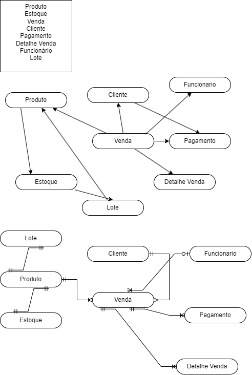
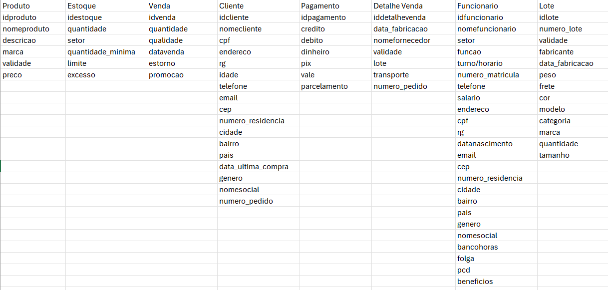
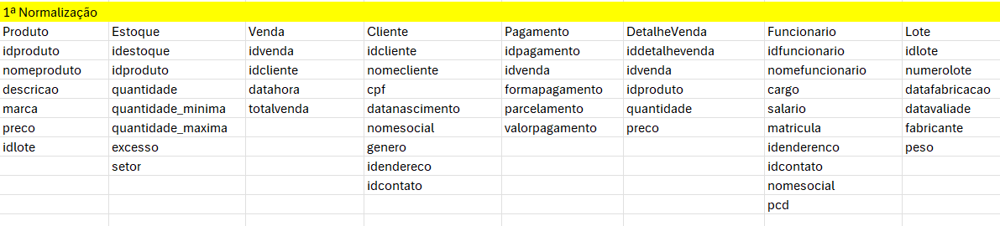
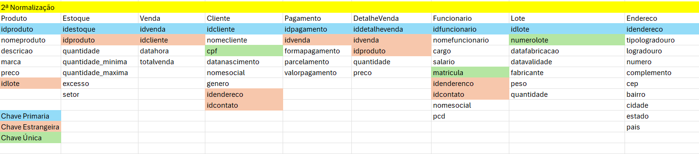
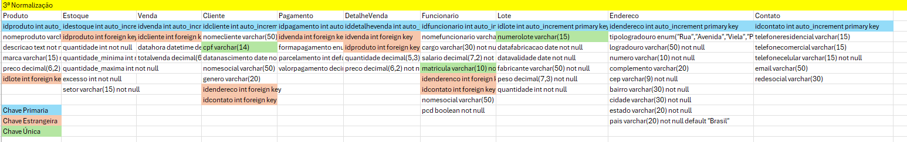
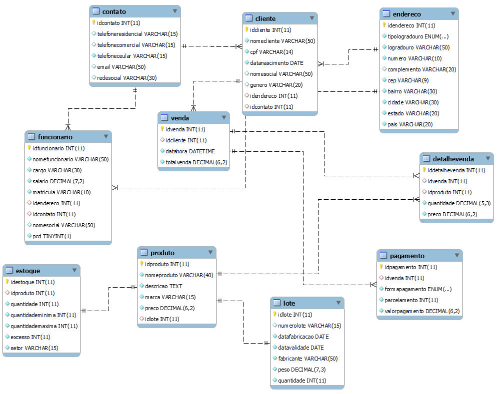

# Estudo de caso Casa Oliveira

### Casa Oliveira

> Roberto é dono de um mercado no bairro de Vargem Grande, na cidade de 
Tupã. Ele herdou o negócio de seu pai, Gumercindo Oliveira, ela foi aberta em 
1978 na garagem da casa da família, era uma pequena quitanda. Com o passar 
dos anos o negócio cresceu e Gumercindo foi obrigado a ir para outro ponto 
maior e ali permaneceu até os dias atuais.
Roberto, que agora é o novo dono do mercado continuou o negócio seguindo 
da mesma forma que o pai. Ele comprava diretamente com os fornecedores 
grandes volumes de produtos e armazenava em seu estoque. As vezes ele 
comprava muitos produtos que ainda havia em estoque causando uma 
sobrecarga de produtos, ele também tinha muitos produtos estragados, tais 
como: frutas, legumes, iogurtes, leites, frango etc. Também havia muitos 
produtos com o prazo de validade vencido.
Os funcionários eram poucos e faziam muitas coisas ao mesmo tempo. O 
açougueiro também ajudava no estoque, a moça da limpeza ajudava na 
organização dos produtos das prateleiras, além de ajudar na padaria, quanto o 
caixa estava vazio o operador ajudava a repor os laticínios e a limpar a loja. O 
repositor também fazia operação no caixa.
Ao realizar a venda o Roberto, que sabia o nome de quase todos os clientes, 
anotava em um caderno todos os produtos que vendia e que havia em estoque. 
Ao fim do dia , Roberto pegava o caderno de fazia os cálculos de o quanto 
havia vendido, somando o faturamento e realizando a atualização do estoque. 
Isso é feito todos os dias e toma um tempo considerável para que tudo seja 
feito.
Roberto fechava a loja as 18h, mas só ia para casa as 22h, após fazer todas as 
operações necessárias. Mesmo assim o negócio vai bem e Roberto pretende ir 
para outro ponto e aumentar o volume de negócios e contratar novos 
funcionários.
Marica, esposa de Roberto, vem conversando com ele há muito tempo para que 
ele contrate uma empresa para construir um sistema de informática para 
gerenciar o negócio e reduzir o tempo que ele passa trabalhando e tenha maior 
organização dos produtos, maior lucratividade e melhorar a gestão.
Com a intenção de aumentar o negócio, Roberto está disposto a informatizar 
sua empresa. Vamos ajudá-lo. Iremos começar construindo o banco de dados

## Modelo Conceitual do estudo de caso



## Modelo Lógico com as normalizações



### Primeira Normalização



### Segunda Normalização



### Terceira Normalização



## Modelo Físico
### Código escrito em sql

``` sql
CREATE DATABASE casaoliveiradb;
USE casaoliveiradb;

DROP TABLE IF EXISTS `contato`;
CREATE TABLE `contato` (
  `idcontato` int(11) NOT NULL AUTO_INCREMENT,
  `telefoneresidencial` varchar(15) DEFAULT NULL,
  `telefonecomercial` varchar(15) DEFAULT NULL,
  `telefoneceular` varchar(15) NOT NULL,
  `email` varchar(50) DEFAULT NULL,
  `redesocial` varchar(30) DEFAULT NULL,
  PRIMARY KEY (`idcontato`)
) ENGINE=InnoDB DEFAULT CHARSET=utf8mb4 COLLATE=utf8mb4_general_ci;


DROP TABLE IF EXISTS `endereco`;
CREATE TABLE `endereco` (
  `idendereco` int(11) NOT NULL AUTO_INCREMENT,
  `tipologradouro` enum('Rua','Avenida','Viela','Praça','Alameda','Vila','Estrada','Rodovia','Travessa') NOT NULL,
  `logradouro` varchar(50) NOT NULL,
  `numero` varchar(10) NOT NULL,
  `complemento` varchar(20) DEFAULT NULL,
  `cep` varchar(9) NOT NULL,
  `bairro` varchar(30) NOT NULL,
  `cidade` varchar(30) NOT NULL,
  `estado` varchar(20) NOT NULL,
  `pais` varchar(20) NOT NULL DEFAULT 'Brasil',
  PRIMARY KEY (`idendereco`)
) ENGINE=InnoDB DEFAULT CHARSET=utf8mb4 COLLATE=utf8mb4_general_ci;


DROP TABLE IF EXISTS `cliente`;
CREATE TABLE `cliente` (
  `idcliente` int(11) NOT NULL AUTO_INCREMENT,
  `nomecliente` varchar(50) NOT NULL,
  `cpf` varchar(14) NOT NULL,
  `datanascimento` date NOT NULL,
  `nomesocial` varchar(50) DEFAULT NULL,
  `genero` varchar(20) DEFAULT NULL,
  `idendereco` int(11) DEFAULT NULL,
  `idcontato` int(11) DEFAULT NULL,
  PRIMARY KEY (`idcliente`),
  UNIQUE KEY `cpf` (`cpf`),
  KEY `fk_cliente_pk_endereco` (`idendereco`),
  KEY `fk_cliente_pk_contato` (`idcontato`),
  CONSTRAINT `fk_cliente_pk_contato` FOREIGN KEY (`idcontato`) REFERENCES `contato` (`idcontato`),
  CONSTRAINT `fk_cliente_pk_endereco` FOREIGN KEY (`idendereco`) REFERENCES `endereco` (`idendereco`)
) ENGINE=InnoDB DEFAULT CHARSET=utf8mb4 COLLATE=utf8mb4_general_ci;


DROP TABLE IF EXISTS `funcionario`;
CREATE TABLE `funcionario` (
  `idfuncionario` int(11) NOT NULL AUTO_INCREMENT,
  `nomefuncionario` varchar(50) NOT NULL,
  `cargo` varchar(30) NOT NULL,
  `salario` decimal(7,2) NOT NULL,
  `matricula` varchar(10) NOT NULL,
  `idendereco` int(11) DEFAULT NULL,
  `idcontato` int(11) DEFAULT NULL,
  `nomesocial` varchar(50) DEFAULT NULL,
  `pcd` tinyint(1) NOT NULL,
  PRIMARY KEY (`idfuncionario`),
  UNIQUE KEY `matricula` (`matricula`),
  KEY `fk_funcionario_pk_endereco` (`idendereco`),
  KEY `fk_funcionario_pk_contato` (`idcontato`),
  CONSTRAINT `fk_funcionario_pk_contato` FOREIGN KEY (`idcontato`) REFERENCES `contato` (`idcontato`),
  CONSTRAINT `fk_funcionario_pk_endereco` FOREIGN KEY (`idendereco`) REFERENCES `endereco` (`idendereco`)
) ENGINE=InnoDB DEFAULT CHARSET=utf8mb4 COLLATE=utf8mb4_general_ci;


DROP TABLE IF EXISTS `lote`;
CREATE TABLE `lote` (
  `idlote` int(11) NOT NULL AUTO_INCREMENT,
  `numerolote` varchar(15) DEFAULT NULL,
  `datafabricacao` date NOT NULL,
  `datavalidade` date NOT NULL,
  `fabricante` varchar(50) NOT NULL,
  `peso` decimal(7,3) NOT NULL,
  `quantidade` int(11) NOT NULL,
  PRIMARY KEY (`idlote`),
  UNIQUE KEY `numerolote` (`numerolote`)
) ENGINE=InnoDB DEFAULT CHARSET=utf8mb4 COLLATE=utf8mb4_general_ci;


DROP TABLE IF EXISTS `produto`;
CREATE TABLE `produto` (
  `idproduto` int(11) NOT NULL AUTO_INCREMENT,
  `nomeproduto` varchar(40) NOT NULL,
  `descricao` text NOT NULL,
  `marca` varchar(15) NOT NULL,
  `preco` decimal(6,2) NOT NULL,
  `idlote` int(11) DEFAULT NULL,
  PRIMARY KEY (`idproduto`),
  KEY `fk_produto_pk_lote` (`idlote`),
  CONSTRAINT `fk_produto_pk_lote` FOREIGN KEY (`idlote`) REFERENCES `lote` (`idlote`)
) ENGINE=InnoDB DEFAULT CHARSET=utf8mb4 COLLATE=utf8mb4_general_ci;


DROP TABLE IF EXISTS `estoque`;
CREATE TABLE `estoque` (
  `idestoque` int(11) NOT NULL AUTO_INCREMENT,
  `idproduto` int(11) DEFAULT NULL,
  `quantidade` int(11) NOT NULL,
  `quantidademinima` int(11) NOT NULL,
  `quantidademaxima` int(11) NOT NULL,
  `excesso` int(11) NOT NULL,
  `setor` varchar(15) NOT NULL,
  PRIMARY KEY (`idestoque`),
  KEY `fk_estoque_pk_produto` (`idproduto`),
  CONSTRAINT `fk_estoque_pk_produto` FOREIGN KEY (`idproduto`) REFERENCES `produto` (`idproduto`)
) ENGINE=InnoDB DEFAULT CHARSET=utf8mb4 COLLATE=utf8mb4_general_ci;


DROP TABLE IF EXISTS `venda`;
CREATE TABLE `venda` (
  `idvenda` int(11) NOT NULL AUTO_INCREMENT,
  `idcliente` int(11) DEFAULT NULL,
  `datahora` datetime NOT NULL DEFAULT current_timestamp(),
  `totalvenda` decimal(6,2) NOT NULL,
  PRIMARY KEY (`idvenda`),
  KEY `fk_venda_pk_cliente` (`idcliente`),
  CONSTRAINT `fk_venda_pk_cliente` FOREIGN KEY (`idcliente`) REFERENCES `cliente` (`idcliente`)
) ENGINE=InnoDB DEFAULT CHARSET=utf8mb4 COLLATE=utf8mb4_general_ci;


DROP TABLE IF EXISTS `pagamento`;
CREATE TABLE `pagamento` (
  `idpagamento` int(11) NOT NULL AUTO_INCREMENT,
  `idvenda` int(11) DEFAULT NULL,
  `formapagamento` enum('Dinheiro','Débito','Crédito','Pix','Vale Alimentação','Vale Refeição','Voucher','Cartão Loja','Gift Card') NOT NULL,
  `parcelamento` int(11) NOT NULL DEFAULT 1,
  `valorpagamento` decimal(6,2) NOT NULL,
  PRIMARY KEY (`idpagamento`),
  KEY `fk_pagamento_pk_venda` (`idvenda`),
  CONSTRAINT `fk_pagamento_pk_venda` FOREIGN KEY (`idvenda`) REFERENCES `venda` (`idvenda`)
) ENGINE=InnoDB DEFAULT CHARSET=utf8mb4 COLLATE=utf8mb4_general_ci;


DROP TABLE IF EXISTS `detalhevenda`;
CREATE TABLE `detalhevenda` (
  `iddetalhevenda` int(11) NOT NULL AUTO_INCREMENT,
  `idvenda` int(11) DEFAULT NULL,
  `idproduto` int(11) DEFAULT NULL,
  `quantidade` decimal(5,3) NOT NULL,
  `preco` decimal(6,2) NOT NULL,
  PRIMARY KEY (`iddetalhevenda`),
  KEY `fk_detalhevenda_pk_venda` (`idvenda`),
  KEY `fk_detalhevenda_pk_produto` (`idproduto`),
  CONSTRAINT `fk_detalhevenda_pk_produto` FOREIGN KEY (`idproduto`) REFERENCES `produto` (`idproduto`),
  CONSTRAINT `fk_detalhevenda_pk_venda` FOREIGN KEY (`idvenda`) REFERENCES `venda` (`idvenda`)
) ENGINE=InnoDB DEFAULT CHARSET=utf8mb4 COLLATE=utf8mb4_general_ci;


```


### Modelo de Entidade Relacional

#### Diagrama do relacionamento casa oliveira


